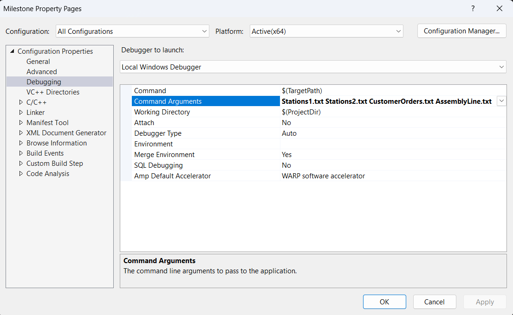

# Assembly Line Project
- The **assembly line** consists of a set of **workstations** each of which holds a set of stock items, which are specific to the station.
- An assembly line is ran by a **line manager** which takes in **customer orders** and moves them along the line, filling the orders at each station.
- Each customer order consists of a list of **items** that need to be filled.
- Each workstation has a limited amount of stock of the items it fills.
- At the end of the line orders are either completed or incomplete: the simulator lists the completed orders and those that are incomplete once the line manager has finished processing all orders.

### Visual Studio is required to run locally

# How to Run
Clone the repository in Visual Studio 
https://learn.microsoft.com/en-us/visualstudio/get-started/tutorial-open-project-from-repo?view=vs-2022

## Setting Command Line Arguments
In Visual Studio, click **Project** and scroll to Properties 
In the popup, go to **Configuration Properties** then **Debugging** 
Click **Command Arguments** and type the arguments in this order and click **Apply** 

### Build solution and then Start without Debugging
